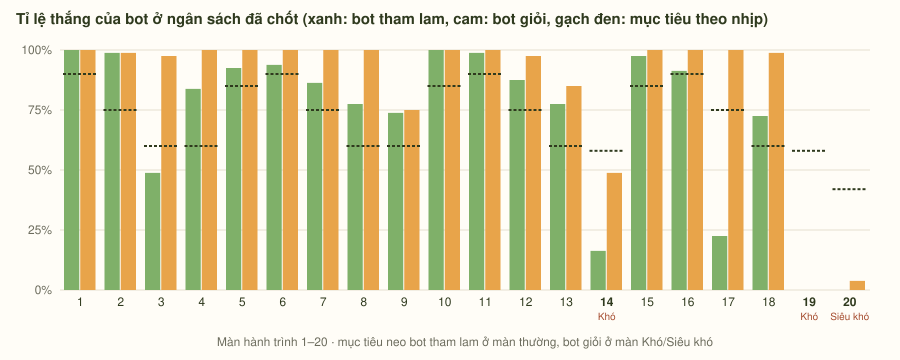
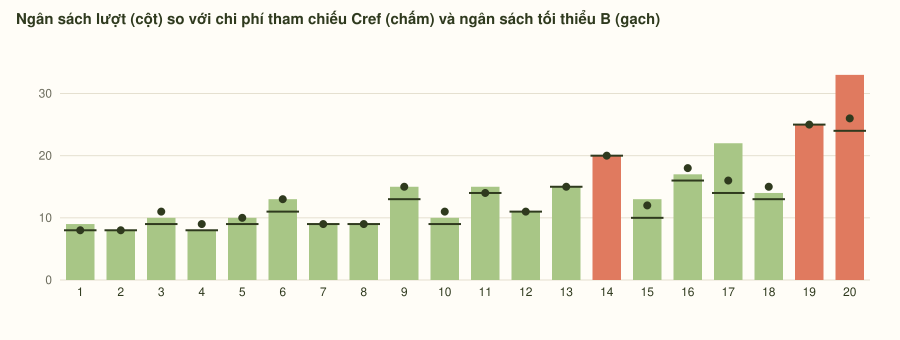
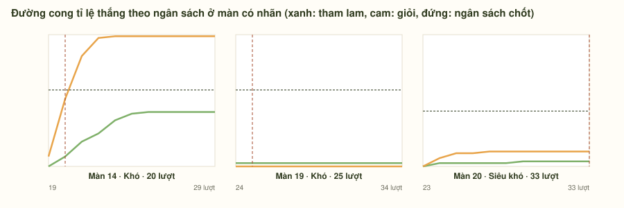
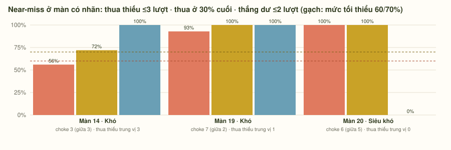
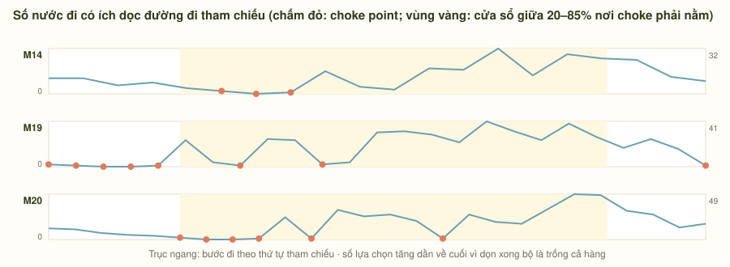
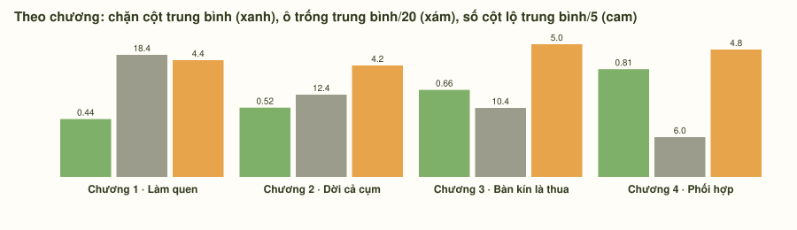

# Báo cáo curve — sinh tự động

Sinh tự động bởi `scripts/report-curve.ts` trong thư mục mã nguồn `gomgom`, từ `src/campaign.ts`, `src/campaign-replays.ts`, `src/campaign-budgets.ts` ngày 2026-09-21. Chạy lại sau mỗi lần đổi layout hoặc hiệu chỉnh:

```sh
node --experimental-strip-types scripts/report-curve.ts
```

## Bảng 20 màn

| Màn | Nhịp | Nhãn | G | Thẻ trên bàn | Ô trống | Cột lộ | Bộ bài | Cref | B | Lượt | Bot thường | Bot giỏi | Planner | Thua thiếu ≤3 | Thua muộn | Thắng dư ≤2 | Choke (giữa) | Hoàn tác/Gợi ý | Cổng |
|---:|---|---|---:|---:|---:|---:|---:|---:|---:|---:|---:|---:|---:|---:|---:|---:|---|---|---|
| 1 | Học |  | 2 | 0 | 20 | 4 | 0 | 8 | 8 | 9 | 100% | 100% | 100% | 100% | 100% | 6% | 0 (0) | 3/2 | đạt |
| 2 | Luyện |  | 2 | 0 | 20 | 4 | 0 | 8 | 8 | 8 | 99% | 99% | 98% | 100% | 100% | 100% | 0 (0) | 3/1 | budget misses target: 99% vs 75%; lệch mục tiêu 99% vs 75% |
| 3 | Kết hợp |  | 3 | 1 | 19 | 5 | 0 | 11 | 9 | 10 | 49% | 98% | 94% | 100% | 100% | 100% | 0 (0) | 2/1 | đạt · vực |
| 4 | Thử thách nhẹ |  | 3 | 5 | 15 | 4 | 0 | 9 | 8 | 8 | 84% | 100% | 99% | 100% | 100% | 100% | 0 (0) | 2/1 | budget misses target: 84% vs 60%; lệch mục tiêu 84% vs 60% |
| 5 | Hồi sức |  | 3 | 2 | 18 | 5 | 0 | 10 | 9 | 10 | 93% | 100% | 100% | 100% | 100% | 100% | 0 (0) | 3/1 | đạt · vực |
| 6 | Học |  | 4 | 5 | 15 | 5 | 0 | 13 | 11 | 13 | 94% | 100% | 100% | 100% | 100% | 100% | 0 (0) | 3/2 | đạt · vực |
| 7 | Luyện |  | 4 | 8 | 12 | 4 | 0 | 9 | 9 | 9 | 86% | 100% | 100% | 100% | 100% | 100% | 0 (0) | 3/1 | đạt · vực |
| 8 | Kết hợp |  | 4 | 10 | 10 | 3 | 0 | 9 | 9 | 9 | 78% | 100% | 100% | 100% | 100% | 100% | 0 (0) | 2/1 | đạt · vực |
| 9 | Thử thách nhẹ |  | 5 | 10 | 10 | 4 | 0 | 15 | 13 | 15 | 74% | 75% | 99% | 90% | 90% | 100% | 0 (0) | 2/1 | đạt |
| 10 | Hồi sức |  | 4 | 5 | 15 | 5 | 0 | 11 | 9 | 10 | 100% | 100% | 100% | 100% | 100% | 100% | 0 (0) | 3/1 | đạt · vực |
| 11 | Học |  | 5 | 6 | 14 | 5 | 0 | 14 | 14 | 15 | 99% | 100% | 100% | 100% | 100% | 79% | 0 (0) | 3/2 | đạt · vực |
| 12 | Luyện |  | 5 | 9 | 11 | 5 | 0 | 11 | 11 | 11 | 88% | 98% | 100% | 100% | 100% | 100% | 0 (0) | 3/1 | đạt · vực |
| 13 | Kết hợp |  | 6 | 12 | 8 | 5 | 0 | 15 | 15 | 15 | 78% | 85% | 100% | 100% | 100% | 100% | 1 (0) | 2/1 | đạt · vực |
| 14 | Thử thách | Khó | 6 | 13 | 7 | 5 | 0 | 20 | 20 | 20 | 16% | 49% | 64% | 56% | 72% | 100% | 3 (3) | 1/0 | budget losses within 3 moves 56% < 60% |
| 15 | Hồi sức |  | 5 | 8 | 12 | 5 | 0 | 12 | 10 | 13 | 98% | 100% | 100% | 100% | 100% | 65% | 0 (0) | 3/1 | đạt · vực |
| 16 | Học |  | 6 | 11 | 9 | 5 | 0 | 18 | 16 | 17 | 91% | 100% | 99% | 100% | 100% | 100% | 0 (0) | 3/2 | đạt |
| 17 | Luyện |  | 6 | 12 | 8 | 5 | 0 | 16 | 14 | 22 | 23% | 100% | 100% | 0% | 0% | 6% | 1 (0) | 3/1 | budget misses target: 23% vs 75%; lệch mục tiêu 23% vs 75% · vực |
| 18 | Kết hợp |  | 6 | 13 | 7 | 5 | 0 | 15 | 13 | 14 | 73% | 99% | 100% | 100% | 100% | 100% | 2 (2) | 2/1 | đạt · vực |
| 19 | Thử thách | Khó | 8 | 18 | 2 | 5 | 0 | 25 | 25 | 25 | 0% | 0% | 50% | 93% | 100% | 100% | 7 (2) | 1/0 | đạt · vực |
| 20 | Tổng kết | Siêu khó | 8 | 16 | 4 | 4 | 0 | 26 | 24 | 33 | 0% | 4% | 38% | 100% | 100% | 0% | 6 (5) | 0/0 | full-board losses 100% > 70%; median moves left on wins 7 > 2 |

Mục tiêu theo nhịp (tuning.ts): bot thường Học 0.9, Luyện 0.75, Kết hợp 0.6, Thử thách nhẹ 0.6, Thử thách 0.4, Hồi sức 0.85, Tổng kết 0.3; bot giỏi Thử thách 0.55, Tổng kết 0.4.

## Hỗ trợ theo nhịp

| Nhịp | Bot neo | Mục tiêu | Hoàn tác miễn phí | Hoàn tác có phí | Gợi ý miễn phí | Gợi ý có phí |
|---|---|---:|---:|---:|---:|---:|
| Học | thường | 0.9 | 3 | 3 | 2 | 2 |
| Luyện | thường | 0.75 | 3 | 3 | 1 | 2 |
| Kết hợp | thường | 0.6 | 2 | 3 | 1 | 2 |
| Thử thách nhẹ | thường | 0.6 | 2 | 3 | 1 | 2 |
| Thử thách | thường | 0.58 | 1 | 2 | 0 | 2 |
| Hồi sức | thường | 0.85 | 3 | 3 | 1 | 2 |
| Tổng kết | thường | 0.42 | 0 | 2 | 0 | 1 |

## Chart












